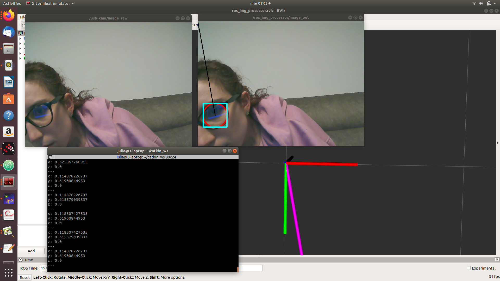
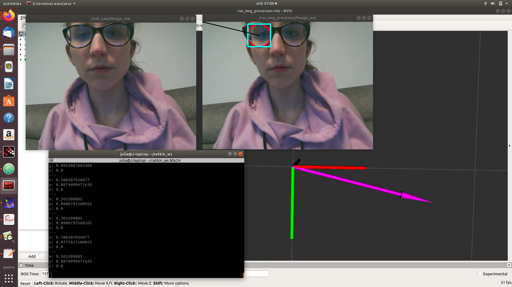
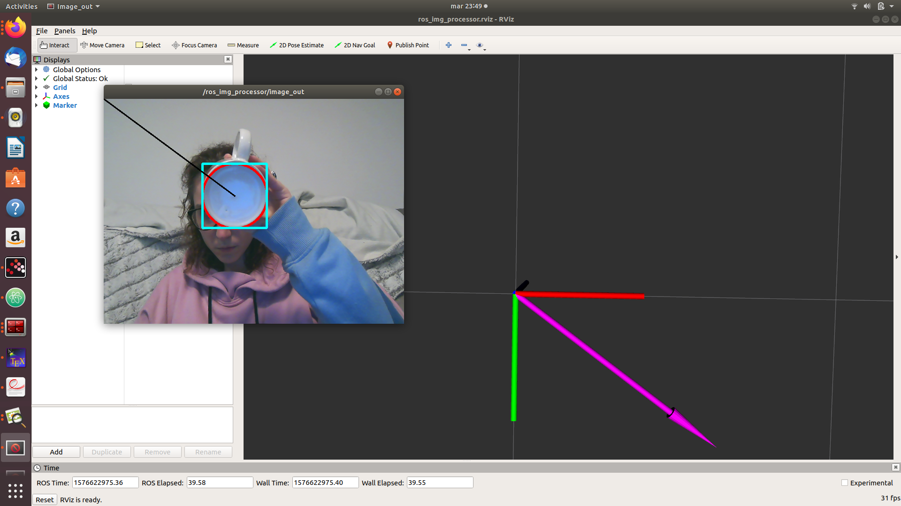

## ros_img_processor
Just a simple template node receiving an image and doing something. Links to OpenCV and ROS wrapped.
[EeasyRobotic](https://github.com/easyrobotic/ros_img_processor.git).

## Tip
Check your webcam encodings (yuyv,mjpeg,...) and set them accordingly at file launch/usb_camera.launch

## CODE

There are the following functions:

1. **process()**(where it processes the main code) -> it has the circle detection algorithm and also computes the direction of the circle, referenced to the camera.
2. **publishImage()**(Image publisher) -> it publishes the image with its detected circles, its squares and its directors.
3. **publishMarker()**(Marker publisher) -> it publishes the marker to RVIZ.
4. **getMarker()**(NEW - Director publisher) -> it publishes the director vector of the circle by a geometry_msgs::vector3.

### Output
It obtains the following outputs:
1. /usb_cam/image_raw -> original image
2. /ros_img_processor/image_out -> image with circles with its boxes and also a simple plotting of the director.
3. RVIZ: representation of the direction in rviz axis.

## Run the code

1. Add this repository in a catkin_workspace/src
2. in catkin_workspace source make *catkin_make --only-pkg-with-deps ros_img_processor*
3. Run launch file *.ros_img_processor ros_img_processor.launch*
4. In a new terminal run *rostopic echo /ros_img_processor/direction*
